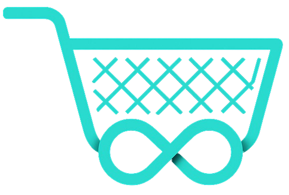

# Shopfinity | Modern E-commerce Platform



## Overview

Shopfinity is a feature-rich e-commerce platform built with React and Vite, offering a seamless shopping experience. The application provides users with a modern interface to browse products, manage their shopping cart, and complete purchases.

## Features

- **Product Browsing**: Browse products across multiple categories including Electronics, Fashion, Home Appliances, Accessories, and more
- **Product Details**: View detailed product information, images, and specifications
- **Category Filtering**: Shop by category with intuitive navigation
- **Shopping Cart**: Add and manage items in your cart with quantity adjustments
- **Checkout Process**: Streamlined checkout with shipping and payment options
- **Responsive Design**: Fully optimized for desktop and mobile devices
- **Search Functionality**: Find products quickly with the integrated search feature

## Technology Stack

- **Frontend Framework**: React.js
- **Build Tool**: Vite
- **Styling**: Tailwind CSS for responsive and modern UI
- **Routing**: React Router for seamless navigation
- **State Management**: React Hooks for efficient state management

## Getting Started

### Prerequisites

- Node.js (version 14.x or later)
- npm or yarn package manager

### Installation

1. Clone the repository
   ```bash
   git clone https://github.com/keshangamage/shopfinity.git
   cd shopfinity
   ```

2. Install dependencies
   ```bash
   npm install
   # or
   yarn install
   ```

3. Start the development server
   ```bash
   npm run dev
   # or
   yarn dev
   ```

4. Open your browser and visit `http://localhost:5173`

## Project Structure

```
shopfinity/
├── public/          # Static assets
├── src/
│   ├── assets/      # Images and media files
│   ├── components/  # Reusable UI components
│   ├── pages/       # Page components
│   ├── styles/      # CSS and style files
│   ├── utils/       # Utility functions
│   ├── App.jsx      # Main application component
│   └── main.jsx     # Application entry point
├── index.html       # HTML entry point
└── package.json     # Project dependencies and scripts
```

## Available Scripts

- `npm run dev` - Start the development server
- `npm run build` - Build the application for production
- `npm run preview` - Preview the production build locally

## Contributing

We welcome contributions to Shopfinity! Please feel free to submit a Pull Request.

## License

This project is licensed under the MIT License - see the LICENSE file for details.

---

Built with ❤️ using React and Vite
